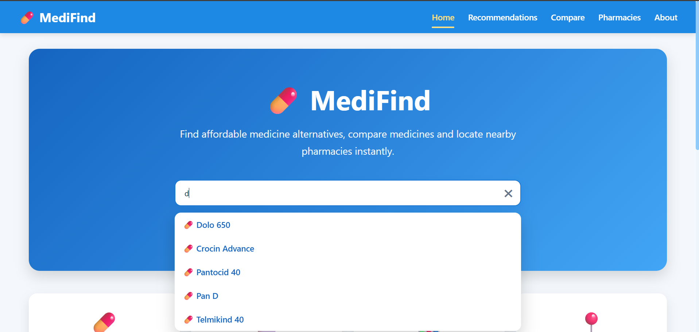
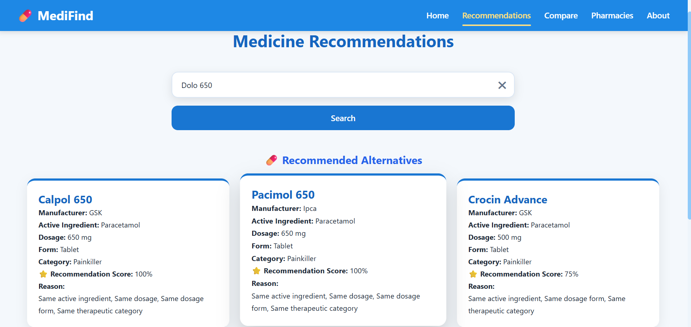
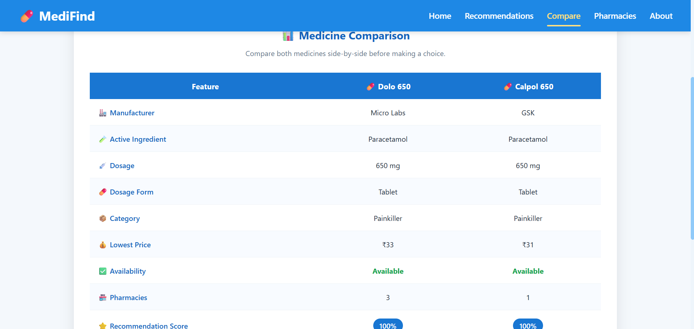
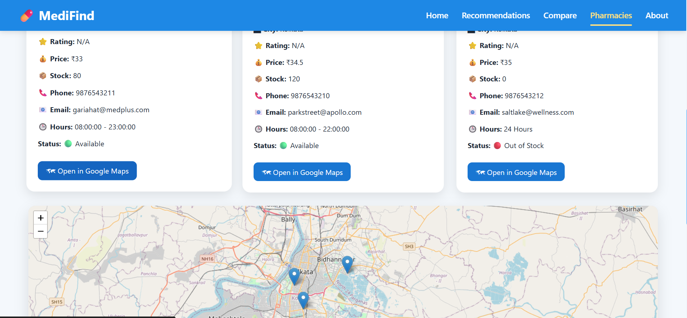
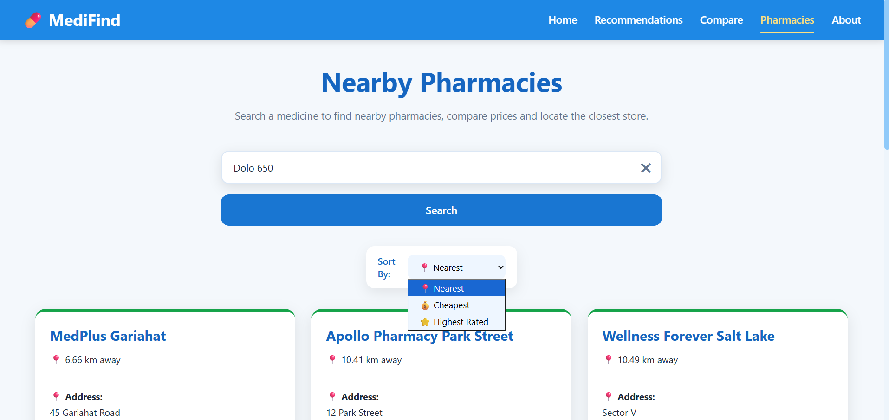
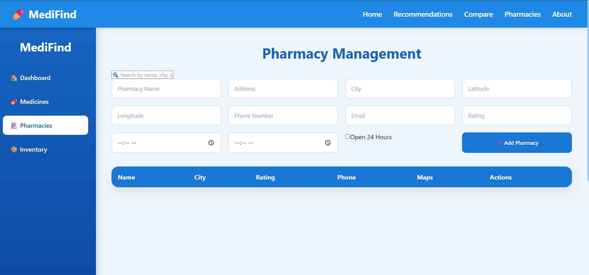

# 💊 MediFind


An AI-powered **Medicine Recommendation and Pharmacy Locator** web application built using **Spring Boot**, **React**, and **MySQL**.

MediFind helps users discover suitable medicine alternatives based on active ingredients, dosage, dosage form, therapeutic category, and similarity scoring while also locating nearby pharmacies that stock the selected medicine.

> **Note:** Pharmacy and inventory data currently use demo datasets. The architecture is designed so that real pharmacies can integrate their own inventories in future versions.

---

# ✨ Features

### 👤 User Features

- 🔍 Search medicines instantly
- 🤖 AI-powered medicine recommendation engine
- 💊 Find the best alternative medicine
- 🔄 Compare two medicines side-by-side
- 🏥 Search pharmacies stocking the selected medicine
- 📦 View stock availability
- 🗺️ Interactive pharmacy map using Leaflet + OpenStreetMap
- 📍 One-click navigation through Google Maps

### 🔐 Admin Features

- Secure JWT Authentication
- Admin Dashboard
- Medicine Management (CRUD)
- Pharmacy Management (CRUD)
- Inventory Management (CRUD)
- Dashboard statistics

---

# 📸 Screenshots

### Home



---

### Medicine Recommendations



---

### Compare Medicines



---

### Pharmacy Locator



---

### Pharmacy Search



---

### Admin Dashboard



---

# 🛠 Tech Stack

## Backend

- Java 17
- Spring Boot
- Spring Security
- JWT Authentication
- Spring Data JPA
- Maven

## Frontend

- React
- Vite
- Axios
- React Router
- Leaflet
- OpenStreetMap

## Database

- MySQL

---

# 📁 Project Structure

```
MediFind
│
├── backend
│   ├── controllers
│   ├── services
│   ├── repositories
│   ├── entities
│   ├── security
│   ├── dto
│   └── data loaders
│
├── frontend
│   ├── components
│   ├── pages
│   ├── services
│   └── assets
│
├── screenshots
│
└── README.md
```

---

# 🚀 Getting Started

## Prerequisites

- Java 17
- Maven
- Node.js
- npm
- MySQL

---

## Clone Repository

```bash
git clone https://github.com/ThisisAshutoshRoy/MediFind.git
```

```
cd MediFind
```

---

# Backend Setup

Navigate to the backend directory.

Create a file named:

```
backend/src/main/resources/application-local.properties
```

Add your own MySQL credentials:

```properties
spring.datasource.url=jdbc:mysql://localhost:3306/medicine_db
spring.datasource.username=YOUR_DATABASE_USERNAME
spring.datasource.password=YOUR_DATABASE_PASSWORD
```

The project uses the **local Spring profile**, allowing database credentials to remain outside version control.

Run the backend:

```bash
mvn spring-boot:run
```

---

# Frontend Setup

```
cd frontend
```

Install dependencies:

```bash
npm install
```

Run:

```bash
npm run dev
```

Frontend runs on:

```
http://localhost:5173
```

---

# 🧠 AI Recommendation Logic

Medicines are recommended using a weighted similarity score based on:

- Active Ingredient
- Dosage
- Dosage Form
- Therapeutic Category
- Drug Similarity

Recommendations are ranked by similarity rather than random matching.

---

# 🗺 Maps

The application uses:

- Leaflet
- OpenStreetMap

Google Maps is only used when users click **Get Directions**, providing real-time navigation without requiring a Google Maps API integration.

---

# 📦 Demo Data

The repository contains demo datasets for:

- Medicines
- Pharmacies
- Inventory

These datasets demonstrate the application's complete functionality.

In a production deployment, pharmacies would connect their own inventory systems through APIs or secure database integrations instead of using demo CSV data.

---

# 🚀 Future Improvements

- Barcode Scanner
- OCR Prescription Reading
- User Accounts
- Medicine Reminder System
- Drug Interaction Checker
- AI Chat Assistant
- Pharmacy API Integration
- Online Ordering
- Multi-language Support
- Advanced Recommendation Model

---

# 🤝 Contributing

Contributions are welcome!

If you'd like to improve MediFind:

1. Fork the repository
2. Create a new feature branch
3. Commit your changes
4. Push your branch
5. Open a Pull Request

For major changes, please open an Issue first to discuss your ideas.

---

# 📄 License

This project is licensed under the **MIT License**.

See the LICENSE file for details.

---

# 👨‍💻 Author

**Ashutosh Roy**

B.Tech — Applied Electronics & Instrumentation Engineering

Netaji Subhash Engineering College

GitHub:
https://github.com/ThisisAshutoshRoy

---

⭐ If you found this project interesting, consider giving it a star!